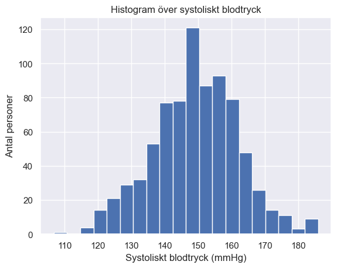
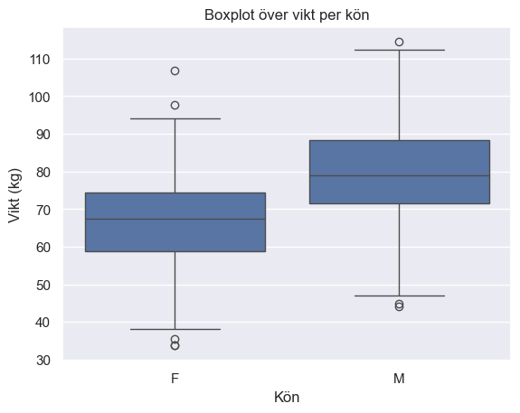
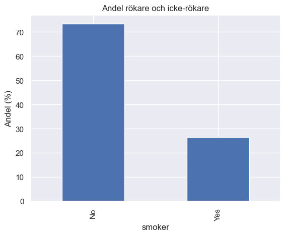

# Hälsostudie – Individuell Uppgift

Detta repository innehåller min individuella analys av ett hälsostudiedataset, genomförd i två delar enligt kursens instruktioner.  
Analysen utförs i Python i en Jupyter Notebook och körs i Visual Studio Code på Windows.

---

## 📁 Projektstruktur

```text
health-study/
│
├── data/
│   └── health_study_dataset.csv
│
├── notebooks/
│   ├── health_study_del1.ipynb
│
├── src/                         (Del 2 – funktioner & klasser)
│
├── requirements.txt
├── .gitignore
└── README.md
```

---

## 🧪 Del 1 – Grundläggande analys & statistik

Notebook:  
`notebooks/health_study_del1.ipynb`

Del 1 innehåller:

### ✔️ Beskrivande statistik
- Medelvärde, median, min och max för:
  - ålder  
  - vikt  
  - längd  
  - systoliskt blodtryck  
  - kolesterol  

### ✔️ Visualiseringar
Minst tre grafer (krav uppfyllt):
- Histogram över systoliskt blodtryck  
- Boxplot över vikt per kön  
- Stapeldiagram över andelen rökare  

## 📊 Visualiseringar (bilder)

### Histogram över systoliskt blodtryck


### Vikt per kön (boxplot)


### Andel rökare



### ✔️ Simulering
- Räkning av sjukdomsandel i datasetet  
- Simulering av 1000 slumpade personer med motsvarande sannolikhet  
- Jämförelse mellan verklig och simulerad sjukdomsförekomst  

### ✔️ Konfidensintervall
Beräkning av 95% konfidensintervall för systoliskt blodtryck med två metoder:
- Normalapproximation  
- Bootstrap  

### ✔️ Hypotesprövning
Test av hypotesen:
> **”Rökare har högre medelblodtryck än icke-rökare.”**  
Genomfört med:
- Welch’s t-test (ensidigt)

Markdown med tolkning inkluderad.

### ✔️ Power-simulering
Simulering av 1000 studier för att uppskatta testets power:
- Hur ofta ett t-test hittar en verklig skillnad  
- Diskussion om resultatet och metodval  

---

## 🔄 Reproducerbarhet

För att notebooken ska köras identiskt:

- Data läses in via relativ sökväg  
  `../data/health_study_dataset.csv`
- Slump-seed sätts i början av notebooken:  
  ```python
  import numpy as np
  np.random.seed(42)
